# skin.unfussy

Unfussy is literaly an unfussy skin mainly designed for a pleasant PVR and LiveTV experience. 

### Dependencies

Unfussy is only dependend on the [Unfussy Helper script](https://github.com/louisbraun/script.unfussy.helper). The script gets automatically installed when installing the skin via [my repository](https://github.com/louisbraun/repository.louis/archive/master.zip).

# Terms of use

With the installation of the skin you agree that you don't use it in combination with blacklisted and illegal Kodi add-ons.
I'm not associated with any available build and I won't give any support to blacklisted, banned or illegal third party addons.

# License

This work has been released under GNU General Public License (GPL), Version 2.0

# Features

- fully customizable home menu and home menu widgets (see below)
- extendedinfo script support (implemented in different views, in particular in the different pvr views it's possible to search for titles in tmdb)
- youtube support (trailers, search for movie / series / live tv titles)
- german telecast offers GTO: widget and dedicated view inside tv guide (GTO is an addon to display live tv recommendations from german broadcasts)
- globalsearch script support
- enhanced EPG information (season and episode numbers, actors, ...) and EPG images. For this corresponding external EPG data which provides these information is needed (I use WebGrab++ to grab EPG data)
- customized "channel guide" view with simplified channel groups handling
- customized "channel list" view with all broadcasts of highlighted channel
- support of movie and music genre icon packs
- enhanced movie and music artwork like movie clearart and clearlogos, artisis clearlogo and album discart (has to be activated via advancedsettings.xml, see [Movie Artwork](https://kodi.wiki/view/Movie_artwork) and [Music Artwork](https://kodi.wiki/view/Music_artwork))
- artistslideshow script support

# The "Home" concept

The Unfussy Home Screen has a slightly different behaviour compared to other Kodi skins. The Home Menu itself, including the different Kodi areas like Movies, TV Shows, Music and so on, is generally hidden but is expandable via the menu icon in the upper left corner. Home Widgets are completely decoupled from this menu and give the opportunity to display your favorite content directly on the Home Screen.

Both the main menu and the widgets are highly customizable via the Skin Setup Menu. 

### Home Menu
This is the default structure of the Home Menu after a fresh skin installation:
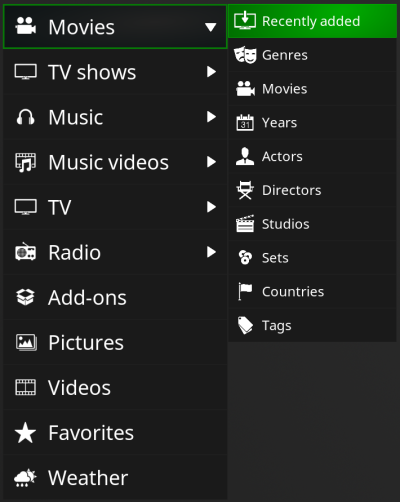

The default menu structure is more or less similar to the Estuary menu structure. The main menu items are direct links to the different Kodi sections like "all titles" for Movies or "music artists" for Music. Where subsections are available, these different subsections can be reached via the corresponding submenu items.

This menu is arbitrary customizable. Via Skin Setup it's possible to change the label and the icon of an item, the order of the menu items and to add or delete both main and submenu items. Menu items have to be assigned to an action that is executed when clicking on the item. Here a list of all actions currently available in Unfussy:
- **Open section in Video Database**: all titles, recently added, genres, years, actors, directors, studios, sets, countries, tags
- **Open section in TV Show Database**: all titles, recently added episodes, genres, years, actors, directors, studios, sets, countries, tags
- **Open section in Music Database**: artists, genres, albums, singles, songs, years, recently played albums, compilations
- **Open section in Music Video Database**: all titles, recently added, genres, years, artists, directors, albums, studios, tags
- **Open Live TV Window**: TV Channel List, TV Guide, TV Recordings, TV Timers, TV Timer Rules, PVR Search
- **Open Live Radio Window**: Radio Channel List, Radio Guide, Radio Recordings, Radio Timers, Radio Timer Rules, Radio PVR Search
- **Open Common Window**: Addon Browser, Pictures, Videos, Favorites, Weather, Video Playlists, Music Playlists
- **Execute Command**: Start Live TV, Start Radio, Play DVD
- **Link to smart Video Playlist**
- **Link to regular or smart Music Playlist**
- **Link to any installed Addon**

### Home Widgets

Widgets are horizontally layed out. The first element in this horizontal list is the widget header, after that the elements of the widget are displayed. The label of the header is customizable, clicking on the header does a "best fit" action depending on the type of widget. If a widget contains "playable" elements like  movies or songs, the element is played, for "non playable" elements an info window is shown.  

Because widgets are very individual per user, after Skin installation only some common widgets are activated (Live TV, TV Recordings, in progress movies, new movies, next episodes, new episodes). These are the widgets possible to activate:

- **Live TV Widgets**
    - **Live TV Channel List**: ordered by "last seen" or "channel number", with channel logo or epg image in poster or landscape format
    - **TV Recordings**: with channel logo or epg image in poster or landscape format
    - **German Telecast Offers**: addon to display "recommendations of the day" for german broadcasts
    - **broadcasts starting add...**: broadcasts of dedicated channels starting around a dedicated time (prime time for instance). Both the time and the channels to be displayed are configurable. After creating a "starting at" widget no channels are preselected. This has to be done afterwards.
    - **TV Timers**: square with channel logo

- **Movie Widgets** (all in poster layout)
    - Inprogress Movies
    - Recently added Movies
    - Movie Playlist - Type "Movie"

- **TV Show Widgets** (all in landscape layout)
    - Recently added TVShows
    - Inprogress TVShows - next Epsiode
    - Movie Playlist - Type "Series"
    - Movie Playlist - Type "Episode"

- **Music Widgets** (all in square layout)
    - unplayed albums
    - mostplayed albums
    - random albums
    - Music Playlist - Type "songs"
    - Music Playlist - Type "albums"
    - Music Playlist - Type "artists"

- **Music Video Widgets** (all in poster layout)
    - recent unwatched musicvideos
    - random musicvideos
    - Movie Playlist - Type "Music Videos"

- **Addon Widgets**
    - **Addons**: list of arbitrary executable addons, order in list is customizable, square layout
    - **Addon Path**: this widget type allows to display content from any video or music addon. To define an "addon path" you have to navigate to the desired folder item inside the addon. With the new context menu option "use as widget path" this path is added to the list of widget paths. Now it is possible to define a widget for this path inside the "Configure Widgets" Skin Setup Menu. Addon Path Widgets can be displayed in the layouts landscape, landscape large and poster. 
    - **Favorites**: list of all Kodi Favorites, square layout

- **Weather Widgets**
    - weather hourly, square layout
    - weather daily, square layout

# Screenshots

### Home Menu with some widgets
[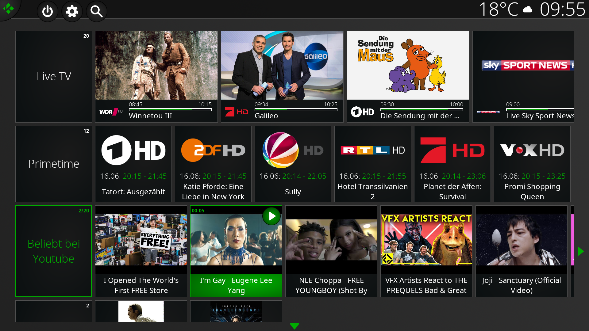](https://github.com/louisbraun/skin.unfussy/raw/master/resources/home.png)

### Movies Fanart View
[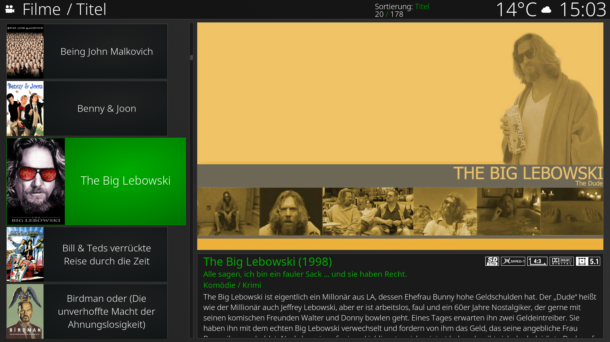](https://github.com/louisbraun/skin.unfussy/raw/master/resources/movies_fanart.png)

### Movieset List View
[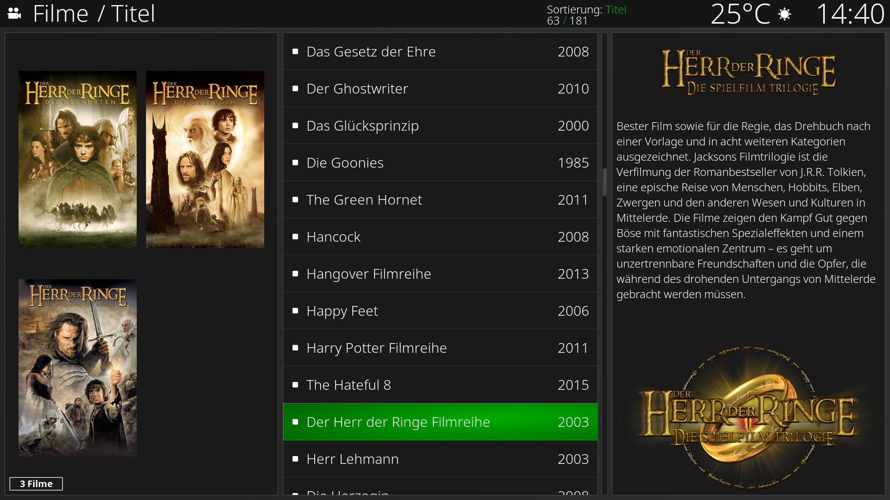](https://github.com/louisbraun/skin.unfussy/raw/master/resources/movieset_list.png)

### TV Shows horizontal Fanart View
[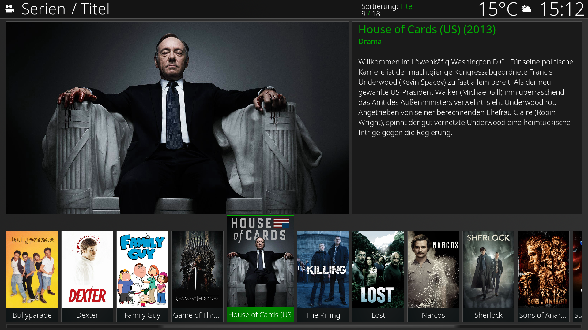](https://github.com/louisbraun/skin.unfussy/raw/master/resources/tvshows_fanart_hor.png)

### TV Shows Episode List View
[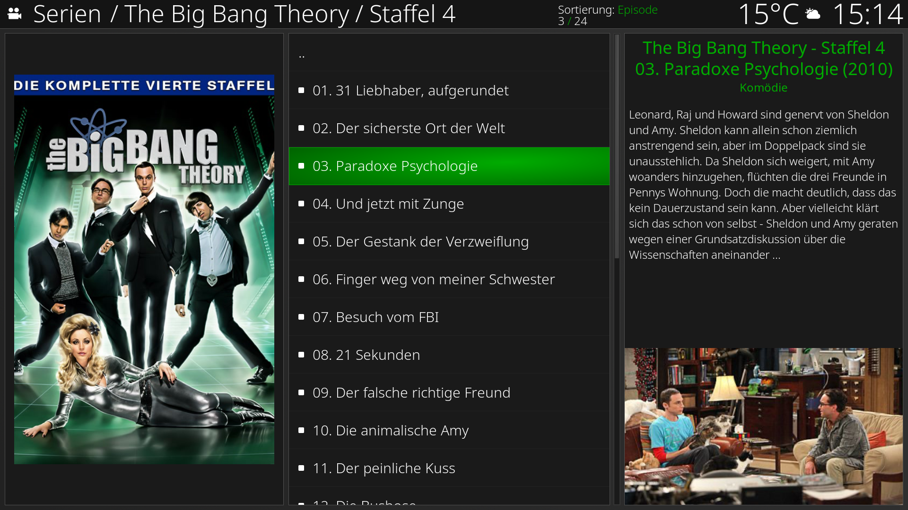](https://github.com/louisbraun/skin.unfussy/raw/master/resources/tvshows_episodes_list.png)

### Music Artists Infowall View
[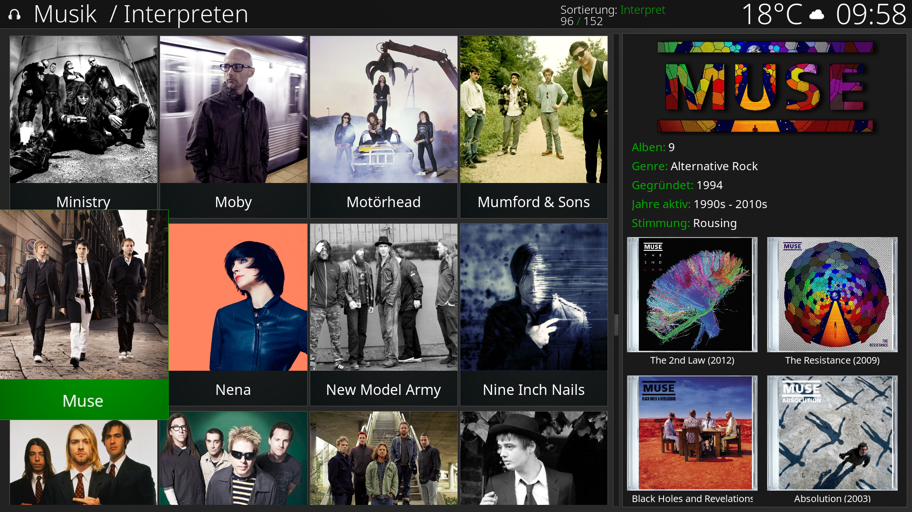](https://github.com/louisbraun/skin.unfussy/raw/master/resources/music_artists_infowall.png)

### Music Albums List View
[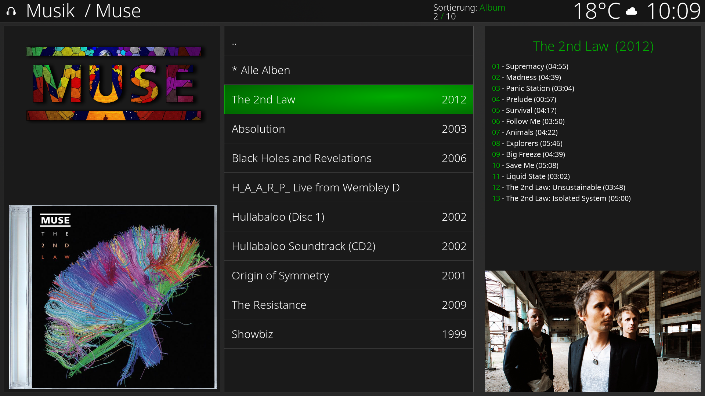](https://github.com/louisbraun/skin.unfussy/raw/master/resources/music_albums_list.png)

### PVR Channel Guide with enhanced Channel Group Support
[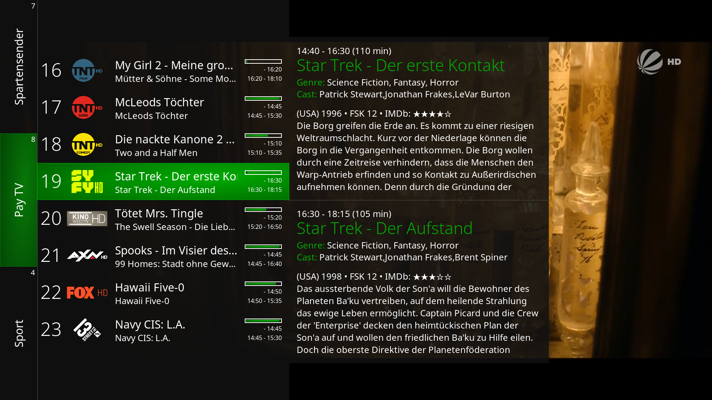](https://github.com/louisbraun/skin.unfussy/raw/master/resources/pvr_channelguide.png)

### PVR Channellist Wall View

### PVR Guide (with 6 channels)
[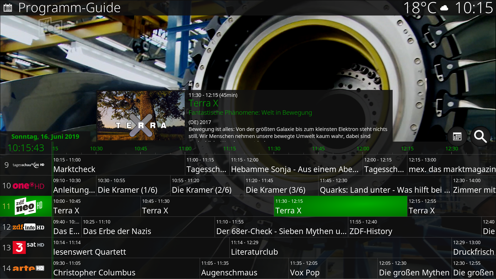](https://github.com/louisbraun/skin.unfussy/raw/master/resources/pvr_guide.png)

### PVR Detail Info View
[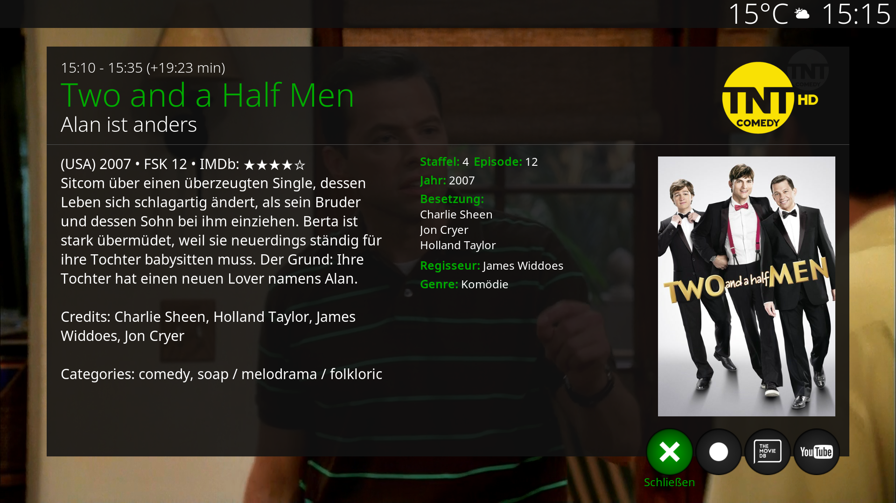](https://github.com/louisbraun/skin.unfussy/raw/master/resources/pvr_info.png)

### PVR OSD
[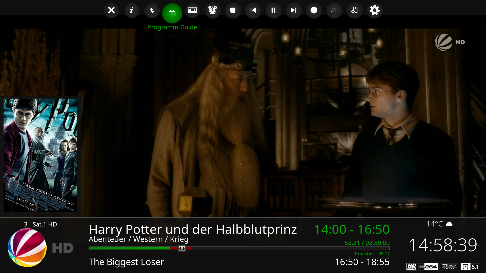](https://github.com/louisbraun/skin.unfussy/raw/master/resources/pvr_osd.png)
